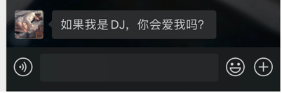
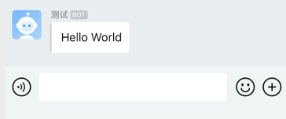
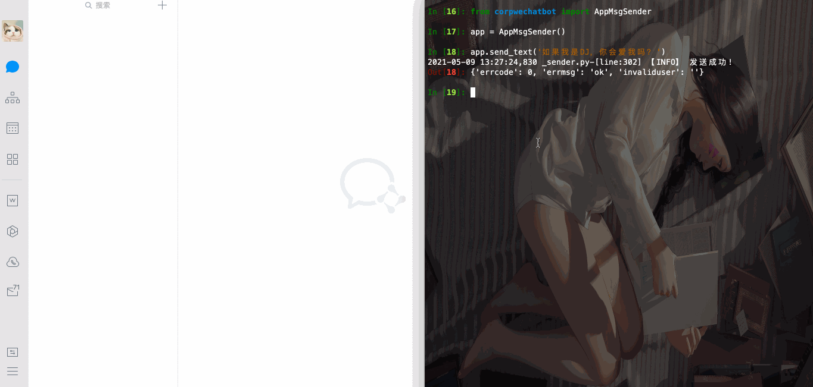

<p align="center">
<a href="https://github.com/GentleCP/corpwechat-bot"></a>
</p>

<p align="center">
<a href="https://hits.seeyoufarm.com"></a>
<a ></a>
<a ></a>
</p>

:wave: `corpwechat-bot`是一个`python`封装的企业机器人&应用消息推送库，通过企业微信提供的api实现。

利用本库，你可以轻松地实现从服务器端发送一条文本、图片、视频、`markdown`等等消息到你的微信手机端，而不依赖于其他的第三方应用，如`ServerChan`。

> 如果喜欢该项目，记得给个star，让更多人能够看到本项目♥️

<details>
<summary><b>为什么要使用corpwechat-bot?</b></summary>

`corpwechat-bot`的定位是让用户随时随地了解服务器端程序的运行结果，同类型的方法有很多，例如邮件，钉钉（这两个的消息推送我在我的另一个库[cptools](https://github.com/GentleCP/cptools)中实现了，有兴趣的可以去看看），bark等。但对于一般人来说，最方便的接收方式还是微信，但个人微信并不提供给开发者API（以前可以用网页微信，现在被禁了）。

拥有同样功能比较知名的有：`ServerChan`，之前提供公众号模板消息推送，但由于微信官方原因，在`21年4月底即将下线`，因此推出了`Turbo`版，支持企业微信消息推送。我在使用过之后发现几个主要问题:raising_hand:，并与`corpwechat-bot`进行了对比：

| 对比项               | ServerChan                                                   | corpwechat-bot                                               |
| -------------------- | ------------------------------------------------------------ | ------------------------------------------------------------ |
| **消息推送限制**     | :disappointed_relieved: 普通用户消息推送次数限制（每天5次，会员不限） | :relaxed: ​`corpwechat-bot`直接和企业微信对接，消息发送仅受微信官方限制（每分钟20条） |
| **个人信息安全性**   | :weary: 个人企业号、应用id和密钥由`ServerChan`云端存储，所有发送的消息也经过`ServerChan`转发（先到`ServerChan`后台，再由`ServerChan`发送到微信） | :innocent: `corpwechat-bot`本身不存储任何用户的密钥（由用户本地保存），所有消息也是直接发送到企业微信后台，保证数据安全性 |
| **创建、使用便捷性** | :persevere: 主要使用步骤：<br />1.  用户注册企业微信<br />2.  创建`ServerChan`应用<br />3.  提交企业号、应用id、应用密钥到`ServerChan`，获取`sendKey`<br />4. 利用`sendKey`发送`http`请求到指定url完成消息发送 | :wink: 主要使用步骤：​<br />1. 用户注册企业微信<br />2. 创建个人消息推送应用，获取相应密钥<br />3. 一条命令`pip install -U corpwechatbot`安装<br />4. 利用`corpwechatbot`的消息发送接口发送消息 |
| **消息类型支持**     | :pensive: 仅支持`title`+`description`（支持`markdown`）的消息发送格式​ | :yum: 支持文本、`markdown`，图片、语音、视频、文件、卡片等多个企业微信提供的消息类型​ |
| **开源**             | :cry: ​不开源，所有代码均由`ServerChan`自身管控               | :sunglasses: 开源在Github​，任何人可以依据源代码添加定制自己想要的功能，或贡献自己的一份力到开源项目中 |

> **特别说明**：虽然上面的对比偏向于突出`corpwechat-bot`的优势，但并没有刻意贬低`ServerChan`的意思，作为一个公开的服务，`ServerChan`的这些特性都是可以被接受的，同时`ServerChan`也是一款**非常优秀**的消息推送工具（我之前一直在使用），支持各大类型的消息推送接口（企业微信、钉钉、bark等等），但考虑到上面的几个特性，所以我选择了自己定制并开源了`corpwechat-bot`，希望给和我一样想法的用户**多一份选择**，如果你觉得上面的特性切中了你的需求点，**麻烦给作者一个小小的`star`以资鼓励吧**～:pray:。未来`corpwechat-bot`还会添加更多的功能和特性，详情查看[Todo](#todo)，当然你也可以在`issue`中提出你的合理需求，或提交PR来帮助`corpwechat-bot`做的更好!!!

</details>


ToC
-----------------

   * [corpwechat-bot](#corpwechat-bot)
      * [QuickStart](#quickstart)
      * [Features](#features)
      * [Usage](#usage)
      * [ChangeLog](#changelog)
      * [Todo](#todo)
      * [Author](#author)
      * [Contibutors](#contibutors)
      * [License](#license)

## QuickStart

> **注意**，本项目依赖于企业微信创建群聊机器人或应用，要想实现需要先注册一个属于你自己的企业微信号（个人免费），这十分简便，参照[官方网址](https://work.weixin.qq.com/) 即可

当你有了企业微信后，你还需要做一些配置，根据你自身的需求来做选择：

- **应用消息推送** ：应用消息推送需要在企业微信中创建一个第三方应用，[参照教程](https://open.work.weixin.qq.com/wwopen/helpguide/detail?t=selfBuildApp)
- **群聊机器人消息推送**：群聊机器人消息推送需要在你已有的企业群中添加一个机器人，然后获取相应的机器人`key`（`webhook`最后面），[参照教程](https://jingyan.baidu.com/article/d45ad148cc79eb28552b80b5.html)

当确定你的配置可用后（企业微信后台尝试发送消息看手机上能否接收到），安装`corpwechatbot`到你的pc中，只需要一条命令：

```shell
pip install -U corpwechatbot
```

下面进行消息推送：

- **应用消息推送**：发送一条文本消息到你设置的应用，在手机个人微信上查看接收

```python
from corpwechatbot.app import AppMsgSender

app = AppMsgSender(corpid='',  # 你的企业id
                   corpsecret='',  # 你的应用凭证密钥
                   agentid='')   # 你的应用id
app.send_text(content="如果我是DJ，你会爱我吗？")
```
推送结果



- **动图演示**


- **群聊机器人消息推送**：发送一条文本消息到你设置了机器人的群聊

```python
from corpwechatbot.chatbot import CorpWechatBot

bot = CorpWechatBot(key='')  # 你的机器人key，通过群聊添加机器人获取

bot.send_text(content='Hello World')
```

推送结果：



- **动图演示**



如果你想要更多的使用技巧，请查看**Usage**


## Features
目前实现了两种推送消息方式，**应用消息推送**和**群聊机器人消息推送**，并且在此基础上，添加了终端一条命令式上述两种消息的推送，具体如下：

- **应用消息推送**：该推送会直接传至你的个人微信上，你会像收到好友消息一样收到通知信息，**不需要安装企业微信**，具体包括：
  - [x] 文本消息: 最普通的消息，文字内容，最长不超过2048个字节
  - [x] 图片消息：发送一张图片，可选`jpg,png`，大小不超过2MB，目前仅支持通过图片路径发送.
  - [x] 语音消息：发送一条语音，大小不超过2MB，时长不超过60s，必须是`.amr`格式
  - [x] 视频消息：发送一段视频，大小不超过10MB，必须是`.mp4`格式
  - [x] 普通文件：其他类型的文件，大小不超过20MB（不小于5字节）
  - [x] markdown消息：传输markdown类型消息
  - [x] 图文消息：图片文字形式，带有跳转链接，适合做推广
  - [x] mpnews图文消息：有专属页面的图文消息，支持html标签内容 
  - [x] 文本卡片消息：以卡片形式呈现的文本，包含跳转链接
  - [ ] 小程序通知消息：应用需绑定小程序才可使用，尚未实现
  - [ ] 任务卡片消息：允许用户点击做出相应反馈的卡片，需绑定回调函数，尚未实现

- **群聊机器人消息推送**：该推送仅会发送消息到企业微信群聊中，经测试，个人微信的企业群聊不会收到机器人发送的消息，因此要收到消息**需安装企业微信**，具体包括：
  - [x] 文本消息：普通文字消息，最长不超过2048个字节
  - [x] 图片消息：图片大小不超过2M
  - [x] 图文消息：图片文字形式，带有跳转链接，适合打广告
  - [x] 文件消息：发送单个文件到群聊，大小在`5B~20MB`之间

- **终端一条命令式消息推送**：不需要写额外的`python`代码，直接在终端输入一条命令`cwb -t='hello world'`即可推送消息到手机微信上，具体参考[Usage](#usage)

## Usage
> ⚠️ 当第一种安装方式失效时，请尝试第二种

- 安装
```python
pip install -U corpwechatbot
```
或者
```python
git clone https://github.com/GentleCP/corpwechat-bot.git
cd corpwechat-bot
pip install .
```
- 使用     

[点此](docs/usage.md)查看详细使用教程


## ChangeLog
你可以在`ChangeLog`中查看最新版本提交的功能和bug修复信息
[点此](docs/changelog.md)查看ChangeLog

## Todo

后续版本待更新的内容：

- [x] `fix`：token存储位置修改，初始设置保存到本地`site-packages`（后期将其移到`site-packages/corpwechatbot`目录下，方便统一）
- [x] `docs`：readme和usage更新
- [ ] `feat`：~~更智能的调用接口（如所有发送用同一接口`send`，根据传入参数的不同自动选择）~~
- [x] `feat`：终端快捷使用，一行命令式消息发送，例如`corpwechatbot -s "hello world"`直接发送一条文本消息
- [x] `refactor`：核心代码优化与重构
- [x] `docs` : 添加`QuickStart` 
- [ ] `feat`：~~添加对应用消息发送到企业微信群聊的支持~~
- [ ] `feat`：添加应用消息任务卡片消息推送的功能（小程序消息暂不考虑）
- [x] `feat`：允许将企业微信配置信息存储到本地文件读取
- [x] `fix`: 修复在指定标签和部门后依然默认发送给全体成员的问题
- [ ] `feat`: ~~添加装饰器发送消息支持~~
- [x] `feat`: 支持多个第三方应用消息推送
- [x] `feat`: 添加对`mpnews`的发送支持

## Author

[@GentleCP](https://github.com/GentleCP)

## Contibutors
- [@GentleCP](https://github.com/GentleCP)

## License
本项目遵守[GPL v3](LICENSE)开源协议