# Usage

## 应用消息推送
该推送会直接传至你的个人微信上，你会像收到好友消息一样收到通知信息，具体包括：

- **文本消息**: 最普通的消息，文字内容，最长不超过2048个字节

```python
from corpwechatbot.app import AppMsgSender

app = AppMsgSender(corpid='',  # 你的企业id
                   corpsecret='',  # 你的应用凭证密钥
                   agentid='')   # 你的应用id
app.send_text(content="如果我是DJ，你会爱我吗？")
```
> 

- **图片消息**：发送一张图片，可选`jpg,png`，大小不超过2MB，目前仅支持通过图片路径发送.
```python
from corpwechatbot.app import AppMsgSender

app = AppMsgSender(corpid='',  # 你的企业id
                   corpsecret='',  # 你的应用凭证密钥
                   agentid='')   # 你的应用id
app.send_image(image_path='test.png')  # 图片存储路径
```
> 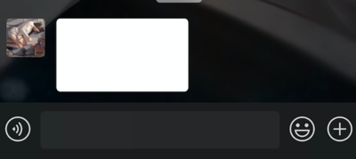

- **语音消息**：发送一条语音，大小不超过2MB，时长不超过60s，必须是`.amr`格式
```python
from corpwechatbot.app import AppMsgSender

app = AppMsgSender(corpid='',  # 你的企业id
                   corpsecret='',  # 你的应用凭证密钥
                   agentid='')   # 你的应用id
app.send_voice(voice_path='test.amr')
```
> 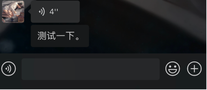

- **视频消息**：发送一段视频，大小不超过10MB，必须是`.mp4`格式
```python
from corpwechatbot.app import AppMsgSender

app = AppMsgSender(corpid='',  # 你的企业id
                   corpsecret='',  # 你的应用凭证密钥
                   agentid='')   # 你的应用id
app.send_video(video_path='test.mp4')
```
> 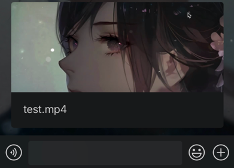

- **普通文件**：其他类型的文件，大小不超过20MB（不小于5字节）
```python
from corpwechatbot.app import AppMsgSender

app = AppMsgSender(corpid='',  # 你的企业id
                   corpsecret='',  # 你的应用凭证密钥
                   agentid='')   # 你的应用id
app.send_file(file_path='test.txt')
```

> 

- **markdown消息（目前仅支持企业微信查看）**：markdown类型消息，支持markdown语法
```python
from corpwechatbot.app import AppMsgSender

app = AppMsgSender(corpid='',  # 你的企业id
                   corpsecret='',  # 你的应用凭证密钥
                   agentid='')   # 你的应用id
app.send_markdown(content='# 面对困难的秘诀 \n > 加油，奥利给！')
```
> 

- **图文消息（目前仅支持企业微信查看）**：图片+文字描述+跳转链接
```python
from corpwechatbot.app import AppMsgSender

app = AppMsgSender(corpid='',  # 你的企业id
                   corpsecret='',  # 你的应用凭证密钥
                   agentid='')   # 你的应用id
app.send_news(title='性感刘公，在线征婚',
              desp='刘公居然要征婚了？这到底是人性的扭曲，还是道德的沦丧？...',
              url='https://blog.gentlecp.com',
              picurl='https://gitee.com/gentlecp/ImgUrl/raw/master/20210313141425.jpg')
```
> 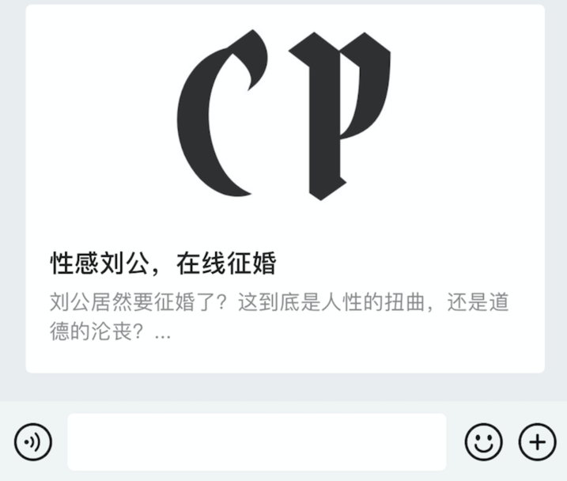

- **卡片消息**：发送一张卡片，带有跳转链接
```python
from corpwechatbot.app import AppMsgSender

app = AppMsgSender(corpid='',  # 你的企业id
                   corpsecret='',  # 你的应用凭证密钥
                   agentid='')   # 你的应用id
app.send_card(title='真骚哥出柜',
              desp='真骚哥竟然出柜了？对象竟然是他...',
              url='https://blog.gentlecp.com',
              btntxt='一睹为快')
```
> 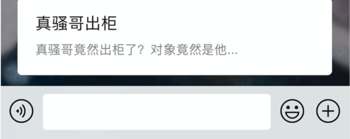


## 群聊机器人消息推送
> 注意，机器人发送的群聊智能在企业微信群聊中收到！！！

- **文本消息**
```python
from corpwechatbot.chatbot import CorpWechatBot

bot = CorpWechatBot(key='')  # 你的机器人key，通过群聊添加机器人获取

bot.send_text(content='Hello World')
```
> 

- **图片消息**
```python
from corpwechatbot.chatbot import CorpWechatBot

bot = CorpWechatBot(key='')  # 你的机器人key，通过群聊添加机器人获取
bot.send_image(image_path='test.png')
```
> 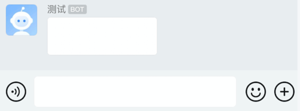

- **markdown消息**
```python
from corpwechatbot.chatbot import CorpWechatBot

bot = CorpWechatBot(key='')  # 你的机器人key，通过群聊添加机器人获取
bot.send_markdown(content='# 面对困难的秘诀 \n > 加油，奥利给！')
```
> 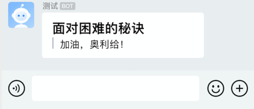

- **图文消息**
```python
from corpwechatbot.chatbot import CorpWechatBot

bot = CorpWechatBot(key='')  # 你的机器人key，通过群聊添加机器人获取
bot.send_news(title='性感刘公，在线征婚',
              desp='刘公居然要征婚了？这到底是人性的扭曲，还是道德的沦丧？...',
              url='https://blog.gentlecp.com',
              picurl='https://gitee.com/gentlecp/ImgUrl/raw/master/20210313141425.jpg')
```
> 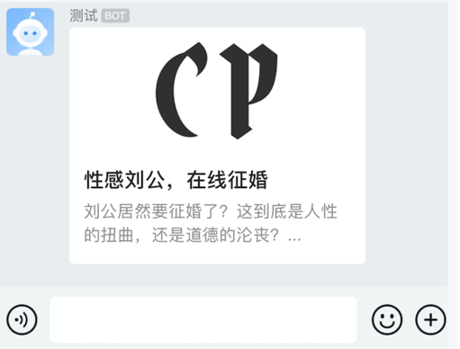

## 更多参数使用
上面只是简单地列出了每个消息推送接口的使用，对于一般使用已经足够了，如果你还有更细致的要求，例如发送给指定人，消息安全性等，需要配置以下参数：
- **应用推送消息**：所有应用推送消息有几个共同参数，用于指定发送消息的特性，如下
    - `touser`: 要发送的用户，通过列表划分，输入成员ID，默认发送给全体
    - `toparty`: 要发送的部门，通过列表划分，输入部门ID，当touser为@all时忽略
    - `totag`: 发送给包含指定标签的人，通过列表划分，输入标签ID，当touser为@all时忽略
    - `safe`: 是否是保密消息，`False`表示可对外分享，`True`表示不能分享且内容显示水印，默认为`False`

```python
# 一个演示程序
from corpwechatbot.app import AppMsgSender

app = AppMsgSender(corpid='',  # 你的企业id
                   corpsecret='',  # 你的应用凭证密钥
                   agentid='')   # 你的应用id

app.send_text(content='Hello',
              touser=['sb'],
              toparty=['1'],
              totag=['1'],
              safe=True)
```
- **群聊推送消息**：群聊消息中发送text消息时可以指定`@`的成员
    - `mentioned_list:[]`: userid列表，提醒群众某个成员，userid通过企业通讯录查看，'@all'则提醒所有人
    - `mentioned_mobile_list:[]`: 手机号列表，提醒手机号对应的成员，'@all'代表所有人，当不清楚userid时可替换

```python
# 一个演示程序
from corpwechatbot.chatbot import CorpWechatBot

bot = CorpWechatBot(key='')  # 你的机器人key，通过群聊添加机器人获取
bot.send_text(content='Hello World',
              mentioned_list=['sb'],
              mentioned_mobile_list=['110'])

```
> 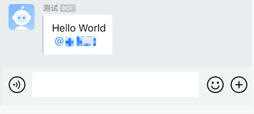

获取相应数据方法（进入企业微信后台->通讯录）：
- 如何获取userID  
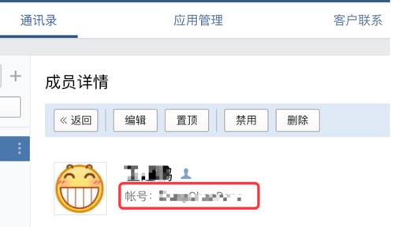
- 如何获取partyID  
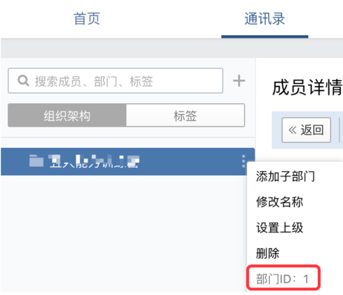
- 如何获取tagID  
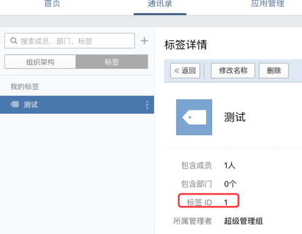
- 如何获取mobile  
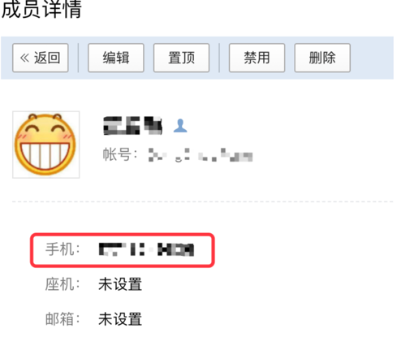