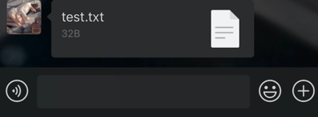
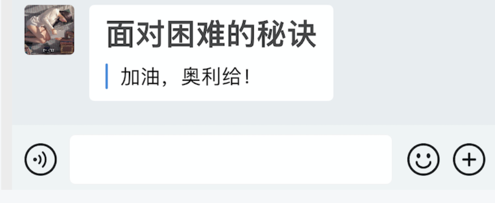

# 应用消息推送
## 推送接口演示

该推送会直接传至你的个人微信上，你会像收到好友消息一样收到通知信息，你需要先初始化一个`AppMsgSender`实例对象，如下：
```python
from corpwechatbot.app import AppMsgSender
# from corpwehcatbot import AppMsgSender  # both will work

app = AppMsgSender(corpid='',  # 你的企业id
                   corpsecret='',  # 你的应用凭证密钥
                   agentid='')   # 你的应用id

# 如果你在本地配置添加了企业微信本地配置文件，也可以直接初始化AppMsgSender，而无需再显式传入密钥参数
# app = AppMsgSender()
```
> 在`v0.3.0`之后，你可以创建多个`AppMsgSender`，以实现通过多个不同的应用的消息发送，这让你可以实现在一个项目中跨用户、跨企业的消息通知，下面是一个例子
```python
app1 = AppMsgSender(corpid='1',  # 你的企业id
                   corpsecret='1',  # 你的应用凭证密钥
                   agentid='1')   # 你的应用id
app2 = AppMsgSender(corpid='2',  # 你的企业id
                   corpsecret='2',  # 你的应用凭证密钥
                   agentid='2')   # 你的应用id
app1.send_text('App1的消息') 
app2.send_text('App2的消息')
```

完成实例创建之后，你可以通过接口实现需要的信息推送，具体包括：

### 文本消息

最普通的消息，文字内容，最长不超过2048个字节

```python
app.send_text(content="如果我是DJ，你会爱我吗？")
```
> 

### 图片消息

发送一张图片，可选`jpg,png`，大小不超过2MB，目前仅支持通过图片路径发送.

```python
app.send_image(image_path='test.png')  # 图片存储路径
```
> 

### 语音消息

发送一条语音，大小不超过2MB，时长不超过60s，必须是`.amr`格式

```python
app.send_voice(voice_path='test.amr')
```
> 

### 视频消息

发送一段视频，大小不超过10MB，必须是`.mp4`格式

```python
app.send_video(video_path='test.mp4')
```
> 

### 普通文件

其他类型的文件，大小不超过20MB（不小于5字节）

```python
app.send_file(file_path='test.txt')
```

> 

### markdown消息

markdown类型消息，支持markdown语法，**目前仅支持企业微信查看**

```python
app.send_markdown(content='# 面对困难的秘诀 \n > 加油，奥利给！')
```
> 

### 图文消息

图片+文字描述+跳转链接，目前仅支持企业微信查看

```python
app.send_news(title='性感刘公，在线征婚',
              desp='刘公居然要征婚了？这到底是人性的扭曲，还是道德的沦丧？...',
              url='https://blog.gentlecp.com',
              picurl='https://gitee.com/gentlecp/ImgUrl/raw/master/20210313141425.jpg')
```
> 

### mpnews图文消息

该图文消息相比于上一个允许更丰富的表达，接受html语法，更多区别请参考官方文档

```python
app.send_mpnews(title='你好，我是CP',
               image_path='data/test.png',
               content='<a href="https://blog.gentlecp.com">Hello World</a>',
               content_source_url='https://blog.gentlecp.com',
               author='GentleCP',
               digest='这是一段描述',
               safe=1)
```


### 卡片消息

发送一张卡片，带有跳转链接

```python
app.send_card(title='真骚哥出柜',
              desp='真骚哥竟然出柜了？对象竟然是他...',
              url='https://blog.gentlecp.com',
              btntxt='一睹为快')
```
> 

### 任务卡片消息

任务发片消息实现用户对服务端的消息进行相应的反馈，如接收到通知后，执行相应操作（如重启）

> 在发送应用卡片消息之前，请确保你已做好相应的[回调配置](#回调配置)

```python
btn = [{
  "key": "yes",
  "name": "好的",
  "color":"red",
  "is_bold": True,
},
  {
    "key": "no",
    "name": "wdnmd"
  }
]
app.send_taskcard(title="老板的消息",
                  desp="下个月工资减半",
                  url="http://127.0.0.1",
                  btn=btn,
                  task_id='12323',) # task_id在应用中是唯一的
```


## 更多参数使用

上面只是简单地列出了每个消息推送接口的使用，对于一般使用已经足够了，如果你还有更细致的要求，例如发送给指定人，消息安全性等，需要配置以下参数：

所有应用推送消息有几个共同参数，用于指定发送消息的特性，如下

- `touser`: 要发送的用户，通过列表划分，输入成员ID，默认发送给全体
- `toparty`: 要发送的部门，通过列表划分，输入部门ID，当touser为`@all`时忽略
- `totag`: 发送给包含指定标签的人，通过列表划分，输入标签ID，当touser为`@all`时忽略
- `safe`(该参数并非所有接口都支持，使用时请确认): 是否是保密消息，`0`表示可对外分享，`1`表示不能分享且内容显示水印，默认为`0`

```python
# 一个演示程序
from corpwechatbot.app import AppMsgSender

app = AppMsgSender(corpid='',  # 你的企业id
                   corpsecret='',  # 你的应用凭证密钥
                   agentid='')   # 你的应用id

app.send_text(content='Hello',
              touser=['sb'],
              toparty=['1'],
              totag=['1'],
              safe=1)
```
> ⚠️注意！在指定`toparty`参数的时候，请确保你应用的可见范围包括该部门，否则会发送失败！很多失败情况都是应用的可见范围没设置正确导致！！


## 获取相关用户数据方法

进入企业微信后台->通讯录

- 如何获取userID

- 如何获取partyID    

- 如何获取tagID  

