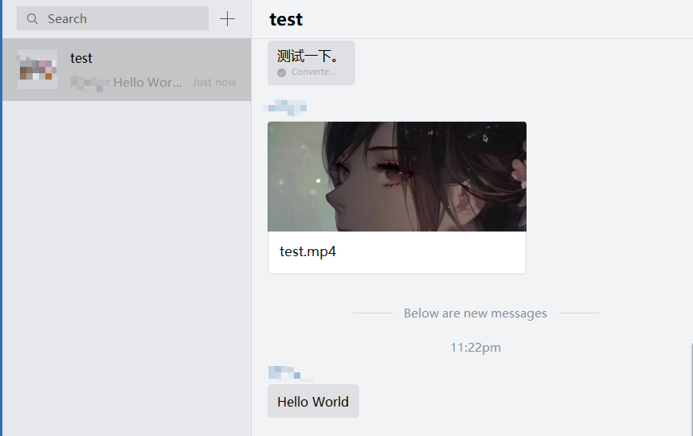

# 应用群聊消息推送

应用群聊消息推送是基于应用（app）创建的群聊实现应用在群聊中的消息推送，目前，其推送的消息只能在**企业微信**中查看，不会在**个人微信**中展示。应用群聊消息推送的好处有几点：   

1. 最少2个人即可建立群聊，企业微信（微信）默认都需要三人以上才能建立群聊，建立群聊后还可以添加群聊机器人（webhook）
2. 应用推送的消息在群聊中展示，而不是单个应用交互的方式，每个人与应用的交互在群聊中展示（大家都看得到）
3. 相比群聊机器人更丰富的消息推送形式（支持除任务卡片和小程序消息以外的所有应用消息推送）

## 推送接口演示
如果你已经掌握了**应用消息推送**，那么你只需要在原来推送消息的基础上添加一个参数`chatid`(群聊id)即可发送对应消息到群聊，在推送消息之前，需要先创建一个群聊。

> ⚠️请先确保加入群聊的用户都在应用的可见范围之内！！！
### 群聊创建
```python
from corpwechatbot import AppMsgSender

app = AppMsgSender()
res = app.create_chat(users=['zhangsan', 'lisi'], owner='zhangsan', name="test", chatid="123")
print(res)
```
> ⚠️注意此时在企业微信中还是看不到群聊的，但群聊已经创建了，需要发送一条消息，让群聊显示出来，请务必保存好返回得到的`chatid`，这是后面消息推送的主要参数

### 消息推送
```python
from corpwechatbot import AppMsgSender

app = AppMsgSender()
app.send_text("hello world", chatid="123") 
```
将应用消息发送到群聊中非常简便，只需要在原来应用消息推送的基础上，添加一个`chatid`即可。


其他消息的推送同理，需要注意的一点是更多的可传入参数`touser`,`toparty`,`totag`在群聊中不可用，`safe`参数可用，更多内容和支持的消息类型参考[官方文档](https://work.weixin.qq.com/api/doc/90000/90135/90248)